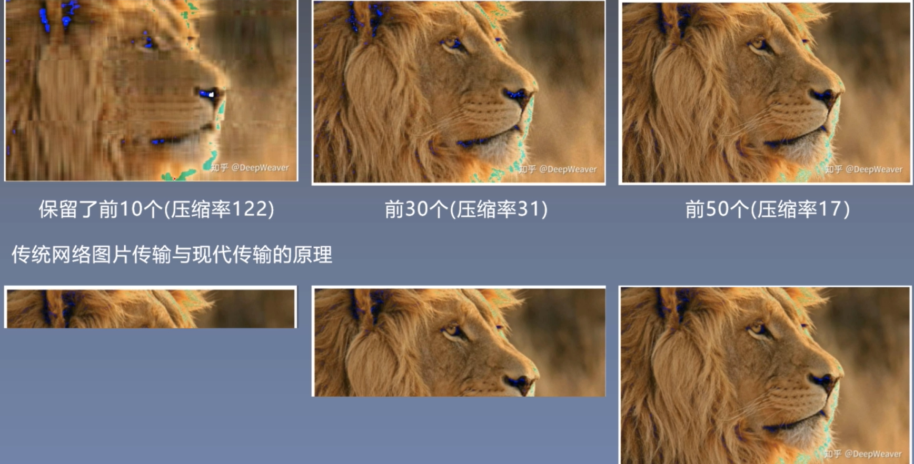
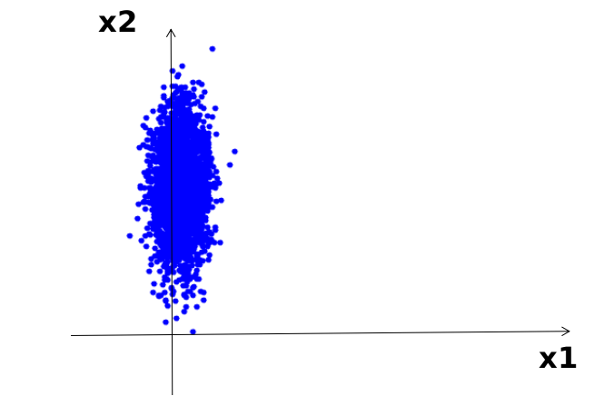
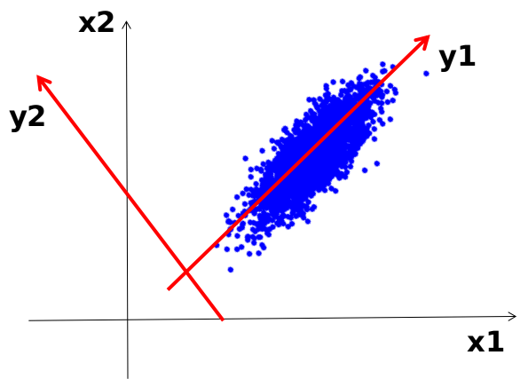
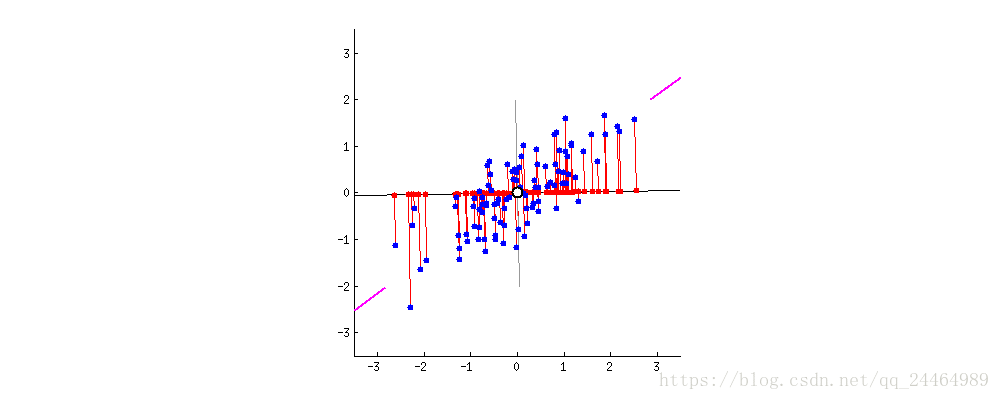
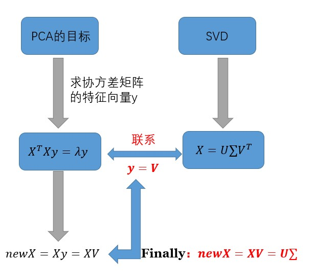
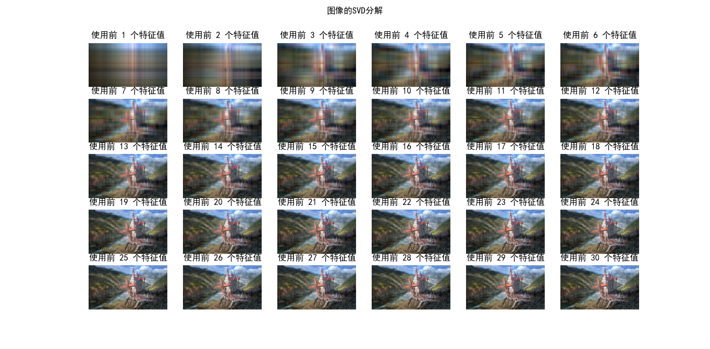

@[TOC](统计学习方法 第15、16章：奇异值分解、主成分分析)

github链接：[https://github.com/gdutthu/Statistical-learning-method](https://github.com/gdutthu/Statistical-learning-method)
知乎专栏链接：[https://zhuanlan.zhihu.com/c_1252919075576856576](https://zhuanlan.zhihu.com/c_1252919075576856576)


在用数据对模型进行训练时，通常会遇到维度过高，也就是数据的特征太多的问题，有时特征之间还存在一定的相关性，这时如果还使用原数据训练模型，模型的精度会大大下降，因此要降低数据的维度，同时新数据的特征之间还要保持线性无关，这样的方法称为主成分分析（Principal component analysis，PCA），新数据的特征称为主成分，**得到主成分的方法有两种：直接对协方差矩阵进行特征值分解（PCA，Principal component analysis）和对数据矩阵进行奇异值分解（SVD，singular value decomposition）**。


# 1 奇异值分解 SVD
## 1.1 提出模型
奇异值分解可以看成矩阵数据压缩的一种方式，即用因子分解的方式近似地表示原始矩阵，这种近似是在平方损失意义下的最优近似。如下图所示，图中方块的颜色表示值的大小，颜色越浅，值越大。对于奇异值矩阵$\Sigma$，只有其主对角线有奇异值，其余均为0。

**借助SVD方法，我们便可以根据实际来提取原始数据的重要信息**。在网络进行图像传输时,当遭遇网络传输速度不佳时，传统网络图片的传输原理是保持图像原始数据不变，逐步进行图像传输。这张旧方法的弊端是若阅览者没有完全接收到图像信息，那么他对这张图像是没有整体的认识。如下图所示，阅览者在传统传输方法中的step1中只能看到狮子的部分毛发，他无法辨认出这张照片的被拍摄对象。但是借助SVD分解方法，现代传输便可以根据实际的网络环境来选择优先传输原始图像的主要信息，阅览者在现代传输方法中的step1中就已经能看出这张照片的被拍摄对象是一头狮子。



先不加以证明给出奇异值分解的定理：对于一个任意的非零矩阵$A$,$A \in R^{m \times n}$,可以分解为三个矩阵的乘积形式，即进行矩阵的因子分解
$$A=U \Sigma V^{\mathrm{T}}$$
其中，矩阵$U_{m \times m}$为$m \times m$的正交矩阵（$U^{T}U=I$）,矩阵$V_{n \times n}$为$n \times n$的正交矩阵（$V^{T}V=I$）,矩阵$\Sigma_{m \times n}$为$m \times n$的对角矩阵
$$
\begin{gathered}
\Sigma_{m \times n}=\begin{bmatrix} \Sigma_{1} & 0 \\ 0 & 0 \end{bmatrix}
\end{gathered}
$$
其中$0$为零矩阵，$\Sigma_{1}=diag(\lambda_{1},\lambda_{2},...,\lambda_{k})$为$k \times k$的对角矩阵，对角线元素从大到小依次排序。即$$\lambda_{1} \geqslant \lambda_{2} \geqslant \cdots \geqslant \lambda_{k} > 0$$
奇异值分解亦可以看成数据集坐标系变换手段。


## 1.2 证明过程
1、构造矩阵$V$
因为矩阵$A^{T}A$是实对称矩阵（复数对称矩阵，性质也一致），那么便一定找到一个正交矩阵$V$实现矩阵$A^{T}A$的对角化，即：
$$V^{\mathrm{T}}\left(A^{\mathrm{T}} A\right) V=\Lambda$$
其中，$\Lambda$是对角矩阵，对角线元素为矩阵$A^{T}A$的特征值；矩阵$V$的列为对应的特征向量。

再证明矩阵$A^{T}A$的特征值都是非负的。证明过程如下：假设$\lambda$为矩阵$A^{T}A$的一个特征值，$x$是对应的特征向量，则
$$\|A x\|^{2}=x^{\mathrm{T}} A^{\mathrm{T}} A x=\lambda x^{\mathrm{T}} x=\lambda\|x\|^{2}$$
于是
$$\lambda=\frac{\|A x\|^{2}}{\|x\|^{2}} \geqslant 0$$
将相应的特征值形成降序排序，即
$$\lambda_{1} \geqslant \lambda_{2} \geqslant \cdots \geqslant \lambda_{r}>0, \quad \lambda_{r+1}=\lambda_{r+2}=\cdots=\lambda_{n}=0$$


则正交矩阵$V$列的排列就是降序排序后的特征值对应的**单位特征向量**（向量的模为1），即
$$V_{1}=\left[\begin{array}{lllllll}
\nu_{1} & \nu_{2} & \cdots & \nu_{r}
\end{array}\right], \quad V_{2}=\left[\begin{array}{llll}
\nu_{r+1} & \nu_{r+2} & \cdots & \nu_{n}
\end{array}\right]$$
其中$\nu_{1},\nu_{2},...,\nu_{r}$分别为$\lambda_{1} \geqslant \lambda_{2} \geqslant \cdots \geqslant \lambda_{r}>0$的单位特征向量；$\nu_{r+1},\nu_{r+2},...,\nu_{n}$分别为$\lambda_{r+1} = \lambda_{r+2} = \cdots= \lambda_{n}=0$的单位特征向量。则
$$V=\left[\begin{array}{ll}
V_{1} & V_{2}
\end{array}\right]$$
2、构造矩阵$\Sigma$

计算上述所得特征值的平方根（实际上就是矩阵A的奇异值）

$$\sigma_{j}=\sqrt{\lambda_{j}}, \quad j=1,2, \cdots, n$$
令
$$\Sigma_{1}=\left[\begin{array}{cccc}
\sigma_{1} & & & \\
& \sigma_{2} & & \\
& & \ddots & \\
& & & \sigma_{r}
\end{array}\right]$$

则$\Sigma_{1}$是一个$r$阶对角矩阵，其对角线元素为按降序排列的正的$\sigma_{1}, \cdots, \sigma_{r}$，于是$m \times n$矩形对角矩阵$\Sigma$可以表示为
$$
\begin{gathered}
\Sigma_{m \times n}=\begin{bmatrix} \Sigma_{1} & 0 \\ 0 & 0 \end{bmatrix}
\end{gathered}
$$
其中$0$为零矩阵。

3、构造矩阵$U$
令
$$u_{j}=\frac{1}{\sigma_{j}} A v_{j}, \quad j=1,2, \cdots, r$$
$$U_{1}=\left[\begin{array}{llll}
u_{1} & u_{2} & \cdots & u_{r}
\end{array}\right]$$
$U_{1}$的列向量构成一组正交基，因为
$$\begin{aligned}
u_{i}^{\mathrm{T}} u_{j} &=\left(\frac{1}{\sigma_{i}} v_{i}^{\mathrm{T}} A^{\mathrm{T}}\right)\left(\frac{1}{\sigma_{j}} A v_{j}\right) \\
&=\frac{1}{\sigma_{i} \sigma_{j}} v_{i}^{\mathrm{T}}\left(A^{\mathrm{T}} A v_{j}\right) \\
&=\frac{\sigma_{j}}{\sigma_{i}} v_{i}^{\mathrm{T}} v_{j}
\end{aligned}$$
若$i=j$，$u_{i}^{\mathrm{T}} u_{j}=1$；若$i≠j$，$u_{i}^{\mathrm{T}} u_{j}=0$

因为$V_{2}$的列向量是矩阵$A^{T}A$对应于特征值为0的特征向量。因此
$$A^{\mathrm{T}} A v_{j}=0, \quad j=r+1, \cdots, n$$
即$AV_{2}=0$，进一步得
$$A=A I=A V_{1} V_{1}^{\mathrm{T}}+A V_{2} V_{2}^{\mathrm{T}}=A V_{1} V_{1}^{\mathrm{T}}$$

再来证明方程$Ax=0$与$A^{T}Ax=0$同解（$N(A)$=$N(A^{T}A)$）
其中
$N(A)$：矩阵$A$的零空间
$N(A^{T}A)$：矩阵$A^{T}A$的零空间

①假设$x_{i}$为方程$Ax=0$的解，即$Ax_{i}=0$
则进一步可得，$A^{T}Ax_{i}=0$
故方程$Ax=0$的解是方程$A^{T}Ax=0$的解
②假设$x_{i}$为方程$A^{T}Ax=0$的解，即$A^{T}Ax_{i}=0$
则上式左乘$x_{i}^{T}$，可得
$$x_{i}^{T}A^{T}Ax_{i}=\|Ax_{i}\|^{2}=0 \Longrightarrow Ax_{i}=0$$
则综上所述，方程$Ax=0$与$A^{T}Ax=0$同解，$N(A)$=$N(A^{T}A)$。所以$V_{2}$的列向量构成$A$的零空间的一组标准正交基。

令$\left\{u_{r+1}, u_{r+2}, \cdots, u_{m}\right\}$为$N\left(A^{\mathrm{T}}\right)$的一组标准正交基，并令
$$\begin{array}{l}
U_{2}=\left[\begin{array}{lll}
u_{r+1} & u_{r+2} & \cdots & u_{m}
\end{array}\right] \\
U=\left[\begin{array}{ll}
U_{1} & U_{2}
\end{array}\right]
\end{array}$$

4、验证上述所得矩阵，即验证$A=U \Sigma V^{\mathrm{T}}$
$$\begin{aligned}
U \Sigma V^{\mathrm{T}} &=\left[U_{1} \quad U_{2}\right]\left[\begin{array}{cc}
\Sigma_{1} & 0 \\
0 & 0
\end{array}\right]\left[\begin{array}{c}
V_{1}^{\mathrm{T}} \\
\cdot V_{2}^{\mathrm{T}}
\end{array}\right] \\
&=U_{1} \Sigma_{1} V_{1}^{\mathrm{T}} \\
&=A V_{1} V_{1}^{\mathrm{T}} \\
&=A
\end{aligned}$$

**辅助记忆**：
对于一个$m \times n$阶的矩阵$A$，可分解成$A_{m \times n}=U_{m \times m} \Sigma_{m \times n} V_{n \times n}^{\mathrm{T}}$,
1、对角矩阵$\Sigma_{1}=diag(\lambda_{1},\lambda_{2},...,\lambda_{k})$中元素满足
$$\lambda_{1} \geqslant \lambda_{2} \geqslant \cdots \geqslant \lambda_{k} > 0$$
且这些元素为矩阵$A^{T}A$（或矩阵$AA^{T}$）的非零特征值从大到小排列，然后再开平方。
注意：矩阵$A^{T}A$与矩阵$AA^{T}$的非零特征值一样，数值为零特征值的个数可能不一致；
1、$U_{m \times m}$为矩阵$AA^{T}$对应特征值$\lambda_{1},\lambda_{2},...,\lambda_{k}$的单位特征向量；
2、$V_{n \times n}$为矩阵$A^{T}A$对应特征值$\lambda_{1},\lambda_{2},...,\lambda_{k}$的单位特征向量。
## 1.3 算法流程
对给定$m \times n$矩阵$A$,下述为求解改矩阵奇异值分解的过程。
（1）计算矩阵$A^{T}A$的特征值和特征向量。得到特征向量$\lambda_{i}$,并将特征向量从大到小进行排列
$$\lambda_{1} \geqslant \lambda_{2} \geqslant \cdots \geqslant \lambda_{n} \geqslant 0$$
（2）求$n$阶正交矩阵$V$。将特征向量单位化，得到单位特征向量$v_{1},v_{2},...,v_{n}$,构成$n$阶正交矩阵$V$。
$$V=\left[\begin{array}{llll}
v_{1} & v_{2} & \cdots & v_{n}
\end{array}\right]$$

（3）求$m \times n$阶对角矩阵$\Sigma$，令$\sigma_{i}=\sqrt{\lambda_{i}}, \quad i=1,2, \cdots, n$，得到以下的$m \times n$阶对角矩阵
$$\Sigma=\operatorname{diag}\left(\sigma_{1}, \sigma_{2}, \cdots, \sigma_{n}\right)$$
（4）求$m$阶正交矩阵$U$,即计算矩阵$AA^{T}$的特征值和特征向量。特征值从大到小进行排列，还是
$$\lambda_{1} \geqslant \lambda_{2} \geqslant \cdots \geqslant \lambda_{n} \geqslant 0$$
对应的特征向量为单位特征向量$u_{1},u_{2},...,u_{m}$,构成$m$阶正交矩阵$U$。
（5）根据上面的计算结果可得矩阵$A$的奇异值分解结果为：
$$A=U \Sigma V^{\mathrm{T}}$$
# 2 主成分分析 PCA

## 2.1 提出模型
**PCA方法和SVD方法的研究背景一样，他们都是要对原始的数据集进行降维处理，只不过在算法细节上有所不同。** 那么我们为什么要对数据集进行降维处理？除了上面SVD过程中讲到的网络图像传输的典型例子外，还有一个比较重要的原因。部分原始数据集若不进行降维处理便会严重影响算法的性能和准确性。
以下图为例子，在未进行降维前，原始数据集聚集在$X_{2}$坐标轴方向，那么此时数据集要是往$X_{1}$坐标轴投影，就会出现数据集混在一起的现象，那么将严重影响算法的准确性。


经过PCA降维处理后，此时数据集再往$Y_{1}$坐标轴投影，便能得到分离度较好的数据集。这样再进行其他研究工作时，便能得到很好的算法效果。


**本质上，主成分分析就是对数据进行正交变换，具体地，对原坐标系进行旋转变换，并将数据在新坐标系上表示。** 如上图所示，原始数据集在坐标系$X_{1}$和$X_{2}$，经过坐标变换后，数据集便在新坐标系$Y_{1}$和$Y_{2}$中表示了。其中，主成分分析选择方差最大的方向（第一主成分）作为新坐标系的第一坐标轴，即$Y_{1}$轴；之后选择与第一坐标轴正交，且方差次之的方向（第二章主成分）作为新坐标系的第二坐标轴。

借助这个动图，我们能很直观的看到PCA降维过程中，数据集坐标系变化的过程。


## 2.2 证明过程
下面先给出符号定义：

 1. $\boldsymbol{X}=\{X_{1},X_{2},...,X_{m}\}$为未经任何处理的原始随机向量，$\Sigma$为随机变量$\boldsymbol{X}$的协方差矩阵。；
 2. 系数矩阵$\alpha=\{\alpha_{1},\alpha_{2},...,\alpha_{k}\}$。其中向量$\alpha_{i}$是原始数据$\boldsymbol{X}$的第$i$个变换方向；
 3. 变换后数据$Y=(Y_{1},Y_{2},...,Y_{k})$,其中$Y_{k}$为$\boldsymbol{X}$的第$k$主成分(即$Y_{k}$是$\boldsymbol{X}$所有线性变换中方差排在第$k$)。
 $$Y_{k}=\alpha_{k}^{\mathrm{T}} \boldsymbol{X}=\alpha_{1 k} X_{1}+\alpha_{2 k} X_{2}+\cdots+\alpha_{m k} X_{m}, \quad k=1,2, \cdots, m$$
 4. 变换后数据对应的方差$\lambda=(\lambda_{1},\lambda_{2},...,\lambda_{k})$,其中$\lambda_{k}$为第$k$个主成分（即$Y_{k}$）的方差。
$$\operatorname{var}\left(y_{k}\right)=\operatorname{var}\left(\alpha_{k}^{\mathrm{T}} \boldsymbol{X}\right)=\alpha_{k}^{\mathrm{T}} \Sigma \alpha_{k}=\lambda_{k}, \quad k=1,2, \cdots, m$$
即协方差矩阵$\Sigma$的第$k$个特征值。

结合上面过程，PCA方法就是需要找到一组正交变换，使得矩阵$A$经过正交变换后，方差最大。
故取$\alpha=\{\alpha_{1},\alpha_{2},...,\alpha_{i},...,\alpha_{k}\}$为一组标准正交基。
$$\alpha_{i}^{\mathrm{T}} \alpha_{j}=\left\{\begin{array}{ll}
1, & i=j \\
0, & i \neq j
\end{array}\right.$$


**采用拉格朗日乘子法求解主成分**。
首先求解第一主成分。如下面式子所示，求解第一主成分就是求解下面约束问题
$$\begin{array}{l}
\max \limits_{\alpha_{1}} \operatorname{var}\left(\alpha_{k}^{\mathrm{T}} \boldsymbol{X}\right)=\alpha_{1}^{\mathrm{T}} \Sigma \alpha_{1} \\
\text { s.t. } \quad \alpha_{1}^{\mathrm{T}} \alpha_{1}=1
\end{array}$$
定义拉格朗日函数
$$L(\alpha_{1},\lambda)=\alpha_{1}^{\mathrm{T}} \Sigma \alpha_{1}-\lambda\left(\alpha_{1}^{\mathrm{T}} \alpha_{1}-1\right)$$
其中$\lambda$是拉格朗日乘子。拉格朗日函数对$\alpha_{1}$求偏导可得
$$\frac{\partial L(\alpha_{1},\lambda)}{\partial \alpha_{1}}=\Sigma \alpha_{1}-\lambda \alpha_{1}=0\Longrightarrow \Sigma \alpha_{1}=\lambda \alpha_{1}$$
因此$\lambda$是$\Sigma$的特征值，$\alpha_{1}$是对应的特征值。于是目标函数可转化为
$$\alpha_{1}^{\mathrm{T}} \Sigma \alpha_{1}=\alpha_{1}^{\mathrm{T}} \lambda \alpha_{1}=\lambda \alpha_{1}^{\mathrm{T}} \alpha_{1}=\lambda$$
则第一主成分就应该是协方差矩阵的最大特征值。依次可推，第k个主成分就是协方差矩阵的特征值降序排序后的第k个特征值。
## 2.3 算法流程
输入：$m \times n$样本矩阵$X$，其每一行的均值为零；
输出：$k \times n$样本主成分矩阵$Y$

（1）构造新的$n \times m$矩阵
$$
X^{'}=\frac{1}{\sqrt{ n-1}}X^{T}
$$
$X^{'}$每一列的均值为零。
（2）对矩阵$X^{'}$进行截断奇异值分解，得到
$$X^{\prime}=U \Sigma V^{\mathrm{T}}$$
有$k$个奇异值、奇异向量。矩阵$V$的前$k$列构成$k$个样本主成分。
（3）求$k \times n$样本主成分矩阵
$$
Y=V^{T} X
$$

# 3 PCA与SVD的异同点
## 3.1 相同点

由上面的分析过程可知‘，对于原数据矩阵$A$
1、PCA求解关键在于求解协方差矩阵$C=\frac{1}{m} A A^{T}$的特征值分解；
2、SVD关键在于$A A^{T}$的特征值分解。
很明显二者所解决的问题非常相似，都是对一个实对称矩阵进行特征值分解。如果取
$$X=\frac{A^{T}}{\sqrt{m}}$$
则有
$$X^{T} X=\left(\frac{A^{T}}{\sqrt{m}}\right)^{T} \frac{A^{T}}{\sqrt{m}}=\frac{1}{m} A A^{T}$$
此时，SVD与PCA等价，所以PCA问题可以转化为SVD问题求解。

## 3.2 不同点
**对比与PCA方法，SVD方法更加高效。** 理由如下：
1、PCA方法需要先求矩阵$A$协方差矩阵$X^{T}X$，再来求解特征值和对应的特征向量，从而求解出右矩阵$V$。但是一般$A$的维度很高，$X^{T}X$的计算量很大
2、SVD方法除了特征值分解这种求解方式外，还有更高效且更准确的迭代求解法，避免了$X^{T}X$的计算,也能求出右奇异矩阵$V$。
# 4 代码附录
在这部部分，将通过对一张图像进行SVD分解，并且逐步提取样本图像的重要信息，来模拟网络传输图片的流程。在SVD分解部分采用调用numpy库函数和自己手写实现两种方式来实现。完整的代码和样图片文件可去本人github下载。（github链接：[https://github.com/gdutthu/Statistical-learning-method](https://github.com/gdutthu/Statistical-learning-method)）。
以下为原始的样本图像


```python
import numpy as np
import matplotlib.image as mping
import matplotlib.pyplot as plt
import matplotlib as mpl

#函数功能：对目标矩阵进行svd分解，提取前n个主成分
#参数说明：n:需要提取前n个特征值,pic:目标矩阵
def image_svd(n, pic):
    a, b, c = np.linalg.svd(pic)                #分别为原始矩阵经SVD分解后所得：U,σ，V矩阵
    svd = np.zeros((a.shape[0],c.shape[1]))     #生成所需的图像矩阵，初始化为零矩阵
    for i in range(0, n):                       #提取出前n个特征值
        svd[i, i] = b[i]
    img = np.matmul(a, svd)                    #将处理后的矩阵分别进行矩阵乘法，将其合并起来
    img = np.matmul(img, c)
    img[ img >= 255] = 255                     #将处理后的矩阵像素值的数值限制在0~255之间
    img[  0 >= img ] = 0
    img = img.astype(np.uint8)
    return img


if __name__=="__main__":
    plt.rcParams['font.sans-serif'] = ['SimHei']  # 用来正常显示中文标签
    plt.rcParams['axes.unicode_minus'] = False    # 用来正常显示负号

    fileName = 'sample.jpg'                       # 样本图像的名称
    img = mping.imread(fileName)                  # 加载原始样本图像信息
    print("图像的原始尺寸:",img.shape)             # 打印样本图像的原始尺寸

    # 新建figure对象,用来展示原始样本图像信息
    fig = plt.figure()
    plt.imshow(img)                       # 将原始的样本照片打印出来
    plt.title("原始样本图像" )             # 图像标题
    plt.axis('on')                        # 显示坐标轴

    # 分别获取图像矩阵的rgb三通道数据
    r = img[:, :, 0]
    g = img[:, :, 1]
    b = img[:, :, 2]

    # 新建figure对象,用来展示原始样本经SVD处理后的图像信息
    plt.figure(figsize=(50, 100))                     #定义所需显示的画布的尺寸
    for i in range(1,31):                             #逐次提取出前30个重要特征值
        r_img = image_svd(i, r)                       #对rgb三通道信息矩阵分别进行SVD分解
        g_img = image_svd(i, g)
        b_img = image_svd(i, b)
        pic = np.stack([r_img, g_img, b_img], axis=2)  #将经SVD分解处理后的rgb三通道矩阵合并
        print("图像的SVD分解，使用前 %d 个特征值"%(i))   #记录此次SVD分解，提取多少个特征值
        plt.subplot(5, 6, i)                           #打印处理后的目标图像
        plt.title("使用前 %d 个特征值" % (i))           #打印图像的一些常规设置
        plt.axis('off')
        plt.imshow(pic)
    plt.suptitle("图像的SVD分解")
    plt.subplots_adjust()
    plt.show()
```
以下为经SVD处理后的样本图像



