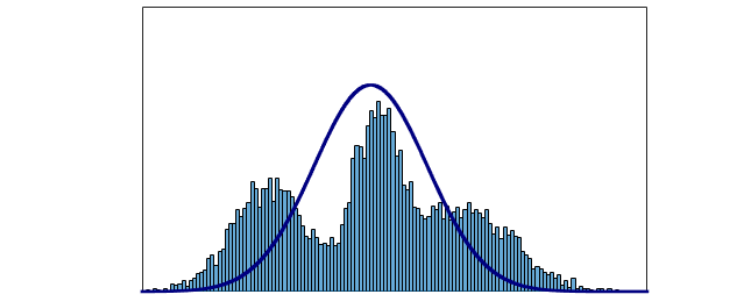
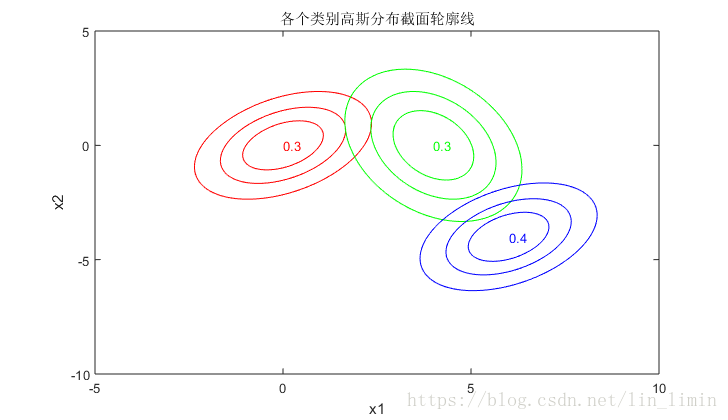
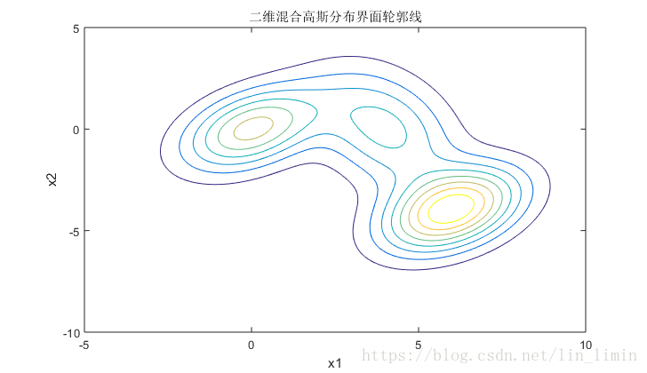

@[TOC](统计学习方法 第8章：提升方法)

github链接：[https://github.com/gdutthu/Statistical-learning-method](https://github.com/gdutthu/Statistical-learning-method)
知乎专栏链接：[https://zhuanlan.zhihu.com/c_1252919075576856576](https://zhuanlan.zhihu.com/c_1252919075576856576)


# 1 提出模型


在讲解EM算法的原理之前，我们先通过一个简单的例子来了解EM算法。给大家推荐一个关于EM算法的博客[【机器学习基础】EM算法](https://blog.csdn.net/u010834867/article/details/90762296)，这个博客对EM算法讲的很清楚。在第一章：提出模型，我就是参考的这个博主的博客。


我们有两个硬币A和B，但是两个硬币正反面的概率不一样($P(A)≠P(B)$)。目前我们只有一组观测数据，要求出每一种硬币投掷时正面向上的概率。总共投了五轮，每轮投掷五次，现在先考虑一种简单的情况，假设我们知道这每一轮用的是哪一个硬币去投掷的：


| 硬币 |    结果    |  统计   |
| :--: | :--------: | :-----: |
|  A   | 正正反正反 | 3正-2反 |
|  B   | 反反正正反 | 2正-3反 |
|  A   | 正反反反反 | 1正-4反 |
|  B   | 正反反正正 | 3正-2反 |
|  A   | 反正正反反 | 2正-3反 |

根据上面的数据，就可以得到
$$
P(A)=\frac{3+1+2}{15}=0.4\\
P(B)=\frac{2+3}{10}=0.5\\
$$


现在把问题变得复杂一点，假设我们不知道每一次投掷用的是哪一种硬币，等于是现在的问题加上了一个隐变量，就是每一次选取的硬币的种类。


|  硬币   |    结果    |  统计   |
| :-----: | :--------: | :-----: |
| Unkonwn | 正正反正反 | 3正-2反 |
| Unkonwn | 反反正正反 | 2正-3反 |
| Unkonwn | 正反反反反 | 1正-4反 |
| Unkonwn | 正反反正正 | 3正-2反 |
| Unkonwn | 反正正反反 | 2正-3反 |


假设我们把每一轮实验的硬币的种类设为:$z_{i},i=1,2,3,4,5$,则这五次实验生成了一个5维的向量 $Z=\{z_{1},z_{2},z_{3},z_{4},z_{5}\}$。现在问题来了，

1、如果我们要根据观测结果去求出PA,PB，那么首先需要知道；

2、但是如果用最大似然估计去估计z，又要先求出PA,PB。这就产生了一个循环。

那么这个时候EM算法的作用就体现出来了，EM算法的基本思想是：先初始化一个$P(A),P(B)$，然后我们拿着这个初始化的$P(A),P(B)$用最大似然概率估计出$Z$，接下来有了z之后就用$Z$去计算出在当前$Z$的情况下的$P(A),P(B)$是多少，然后不断地重复这两个步骤直到收敛。


 有了这个思想之后现在用这个思想来做一下这个例子，假设初始状态下$P(A)=0.2, P(B)=0.7$，然后我们根据这个概率去估计出$Z$：


| 轮数 |    若是硬币A，该实验结果的概率     | 实验结果结果 |    若是硬币B，该实验结果的概率    |
| :--: | :--------------------------------: | :----------: | :-------------------------------: |
|  1   |   0.00512，即0.2,0.2,0.2,0.8,0.8   |   3正-2反    | **0.03087**,即0.7,0.7,0.3,0.7,0.3 |
|  2   | **0.02048**，即0.2,0.2,0.8,0.8,0.8 |   2正-3反    |   0.01323,即0.3,0.3,0.7,0.7,0.3   |
|  3   | **0.08192**，即0.2,0.8,0.8,0.8,0.8 |   1正-4反    |   0.00567,即0.7,0.3,0.3,0.3,0.3   |
|  4   |   0.00512，即0.2,0.2,0.2,0.8,0.8   |   3正-2反    | **0.03087**,即0.7,0.3,0.3,0.7,0.7 |
|  5   | **0.02048**，即0.2,0.2,0.8,0.8,0.8 |   2正-3反    |   0.01323,即0.3,0.7,0.7,0.3,0.3   |


按照最大似然估计，$Z=\{B,A,A,B,A\}$，有了z之后我们反过来重新估计一下$P(A),P(B)$：

$$
P(A) =\frac{2+1+2}{15} = 0.33\\
P(B) =\frac{3+3}{10} =0.6\\
$$
可以看到$P(A),P(B)$的值已经更新了，假设$P(A),P(B)$的真实值0.4和0.5，那么你在不断地重复这两步你就会发现$P(A),P(B)$在不断地靠近这两个真实值。


# 2 EM算法

在对EM算法进行讲解前，我们先来定义EM算法要优化的目标函数。在一个包含有隐变量的概率模型，我们的目标是极大化观测数据$Y$关于参数$\theta$的对数似然函数，即极大化


$$
\begin{equation}\begin{aligned}
L(\theta) &=\log P(Y \mid \theta)=\log \sum_{Z} P(Y, Z \mid \theta) \\
&=\log \left(\sum_{Z} P(Y \mid Z, \theta) P(Z \mid \theta)\right)
\end{aligned}\end{equation}
$$
对上面表达式进行极大化时，我们遇到的主要困难是上面式子中包含隐变量（也称为，未观测数据）的和（或者，积分）的对数。因为无法事先知道隐变量的取值，所以我们很难对其进行优化。

## 2.1 学习策略


## 2.2 收敛性证明


## 2.3 算法流程

 最大期望算法经过两个步骤交替进行计算：

**step1:** 计算期望（E），利用对隐藏变量的现有估计值，计算其最大似然估计值；

**step2:** 最大化（M），最大化在E步上求得的最大似然值来计算参数的值。M步上找到的参数估计值被用于下一个E步计算中，这个过程不断交替进行。


下面以示意图的形式来展示整个算法的计算过程。还是举抛硬币的例子，假设有两枚硬币A、B，以相同的概率随机选择一个硬币，进行如下的抛硬币实验：共做5次实验，每次实验独立的抛十次，结果如图中a所示，例如某次实验产生了H、T、T、T、H、H、T、H、T、H，H代表正面朝上。我们先初始化系统参数$\theta=\{P(A),P(B)\}$,然后根据上面的两步骤进行不断优化系统参数$\theta$，直到算法最后收敛。


# 3 GMM模型

## 3.1 提出模型

在机器学习中，我们常常假设数据服从高斯分布。但是高斯模型是关于均值对称的。从下面数据图可看出，若我们假设采用单个高斯模型来进行建模，这显然是不符合所采集到的数据特征。




于是，我们引入混合高斯模型（Gaussian Mixture Model，GMM）。高斯混合模型就是多个单高斯模型的和。它的表达能力十分强，任何分布都可以用GMM来表示。例如，在上面图中，我们就应该假设该数据是有三个单独的高斯分布模型混合得到的结果。






## 3.2 算法流程


# 4 代码附录


## 4.1 代码附录


```python
def
```

